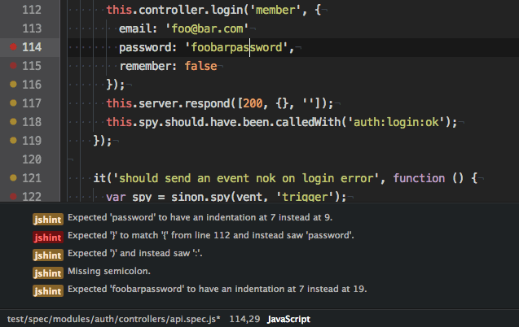

JSCS Linter
===========

A gif is better than everything:

This linter plugin for Atom.io provides an interface to [jscs](https://github.com/mdevils/node-jscs). It will be used with files that have the “JS” syntax.

## Installation
Linter package must be installed in order to use this plugin. If Linter is not installed, please follow the instructions [here](https://github.com/AtomLinter/Linter).

If you don't have `AtomLinter/Linter` run:

* `apm install linter`
* `apm install linter-jscs`

If you already have `AtomLinter/Linter`, you can directly run:

* `apm install linter-jscs`

## Contact
* http://github.com/iam4x
* http://twitter.com/iam4x
* http://iam4x.fr
